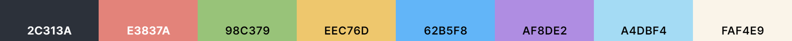

# anisochromatic

A color palette designed to be easy on the eyes, as well as easy to parse!\\
Heavy inspiration is taken from One Dark, Nord, and the Github Dark (Dimmed) themes.

```js
const boson = {
    0: "#23272e",
    1: "#2c313a",
    2: "#363c47",
    3: "#586274"
};

const quark = {
    4: "#ede7dd",
    5: "#f2ece1",
    6: "#faf4e9"
};

const spin = {
    7:  "#e3837a",
    8:  "#eec76d",
    9:  "#98Cc79",
    10: "#62b5f8"
};

const fractal = {
    12: "#de9059",
    11: "#efbf8f",
    13: "#8fbcb1",
    14: "#a4dbf4",
    15: "#af8de2"
};

const anisochromatic = {
    isomorph0:  boson["0"],
    isomorph1:  boson["1"],
    isomorph2:  boson["2"],
    isomorph3:  boson["3"],
    isomorph4:  quark["4"],
    isomorph5:  quark["5"],
    isomorph6:  quark["6"],
    isomorph7:  spin["7"],
    isomorph8:  spin["8"],
    isomorph9:  spin["9"],
    isomorph10: spin["10"],
    isomorph11: fractal["11"],
    isomorph12: fractal["12"],
    isomorph13: fractal["13"],
    isomorph14: fractal["14"],
    isomorph15: fractal["15"],
};
```



## Ports

- [Emacs](https://github.com/isomatter-labs/anisochromatic-emacs)
- [VSCode](https://github.com/isomatter-labs/anisochromatic-vscode)
- [Warp](https://github.com/isomatter-labs/anisochromatic-warp)
- Slack: `#2C313A,#586274,#98CC79,#EEC76D`
